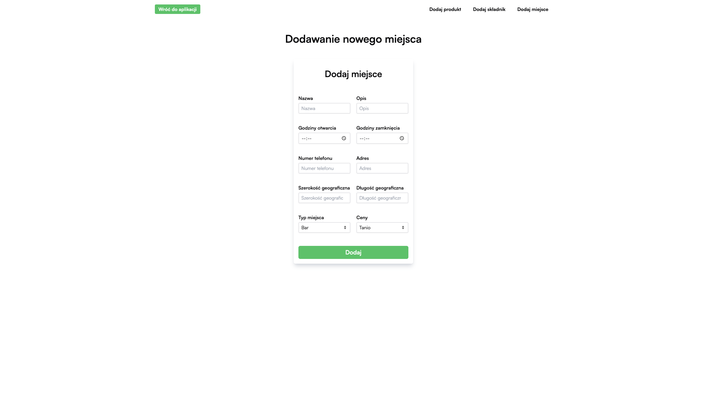
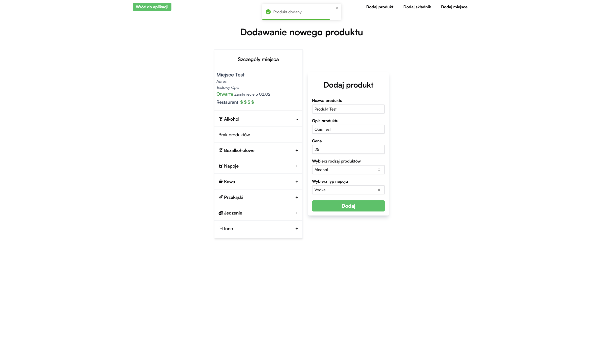
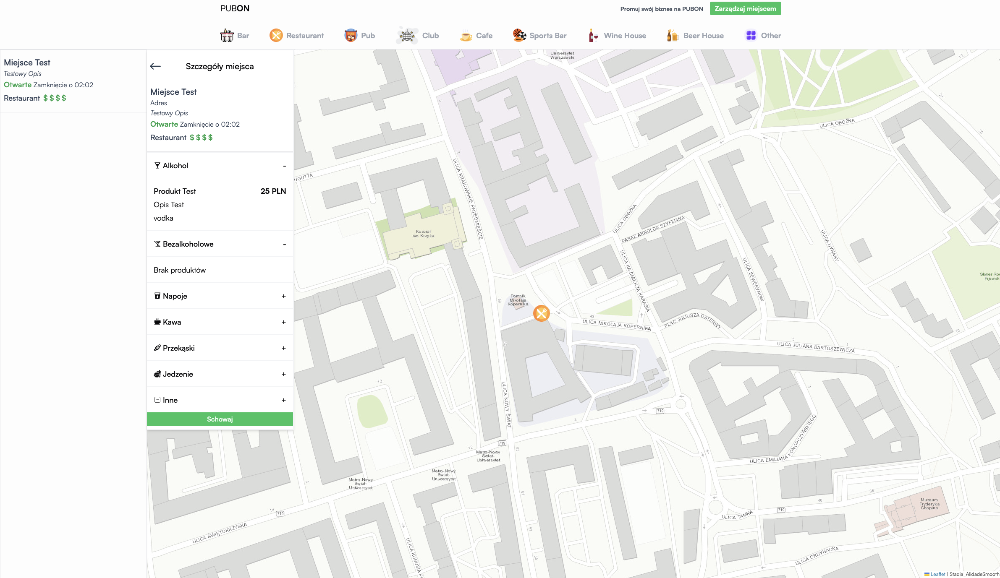

# pubon

### [Landing page](https://pubon-web.pages.dev)

### [Application](https://pubon-web.pages.dev/app)

\*Note: App still is in progress. API is not deployed yet, however here is description and screens from the application.

Pubon is an application created for various nightlife activities. It allows users to check places nearby that are worth visiting. In the future, it will become a community where people can add their own ratings and opinions.


Every place is displayed by specific for place type marker.  

Place can be added by form validated with react-hook-form. Data is being send to the backend.

Products in place can be added also by form.

Added product appears in main sidebar, where data is fetched from API.


## Techstack:

- React
- TypeScript
- TailwindCSS
- React Router
- Redux
- React Hook Form
- TanStack React Query
- React Leaflet
- Vite
- Axios
- ESLint
- Prettier

## .env

```
VITE_API_ENTRYPOINT=https://api.com/v1/

# you can find it here
# https://cloud.maptiler.com/account/keys/
VITE_MAPBOX_KEY=
```
